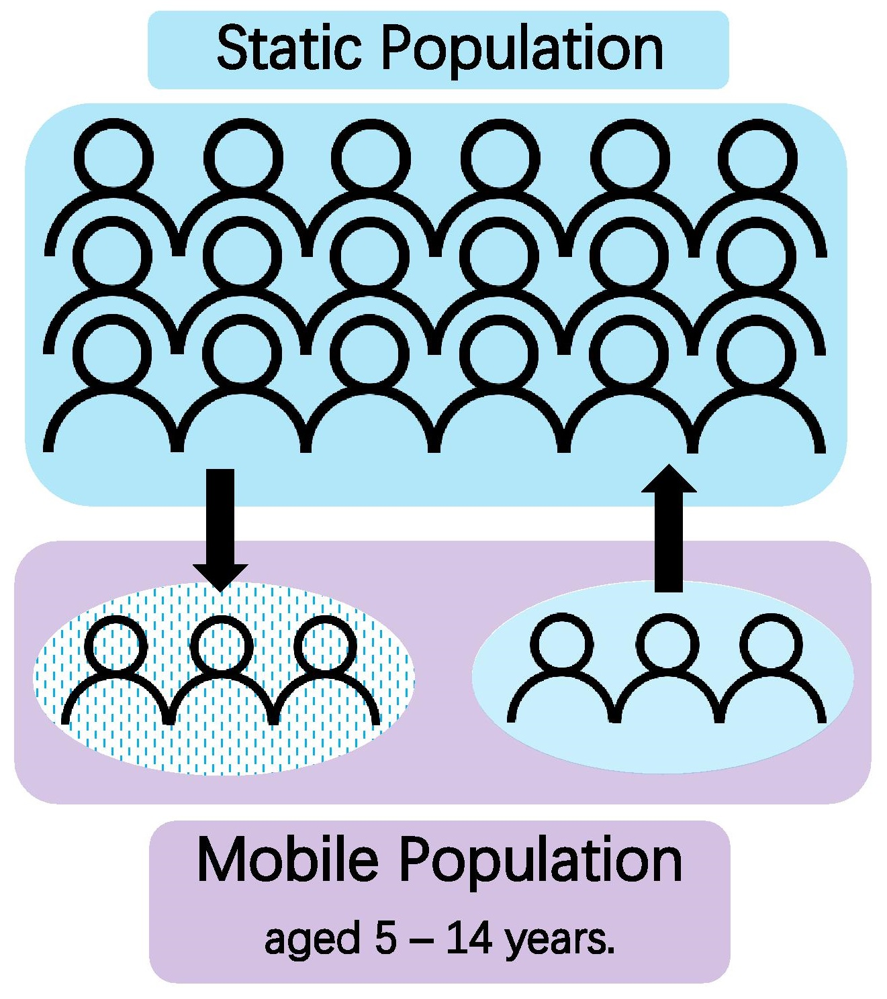

```{r setup, echo=FALSE}


```

<br>

#Is loneliness associated with movement for education?

Recent research has shown that loneliness is a common underlying factor for many physical illnesses, such as cardiovascular disease, dementia... A direction of causality has not been established for this association, however it has prompted an increased interest in loneliness in our population, and how it may be addressed.  

The ONS have developed a ['Loneliness Index'](https://datasciencecampus.ons.gov.uk/developing-a-loneliness-prescription-index/) which determines the levels of loneliness associated with each GP practice, using prescribing data for loneliness-related illnesses. This data is available for the years 2016, 2017 and 2018. Using this, we were tasked to explore whether there was an association between the Loneliness Index scores and movement for the purposes of education, as part of a [data challenge](https://www.bristol.ac.uk/golding/get-involved/competitions/loneliness-and-movement-for-education-competition/) by the ONS and the Jean Golding Institute at the University of Bristol. 
<br><br>

###Why do people move for education?
To develop our research question, we first considered the main reasons why people move for education:

* Undergraduates (individuals) move en-mass to new places in August-October every year. 19 y/os represent the highest movement of people every year for this reason.  
* Families with under 4-s will move to new catchment areas to apply for new schools.  
* Families of 10-11 year olds (& siblings) will also move to new areas for better secondary schools.  
* Children will move as individuals to boarding schools at primary/secondary age.  
* Other individual moves may occur throughout adulthood to pursue educational opportunities.  

<br>

Bearing this in mind, we made the assumption that **in the majority of cases, movement for primary and  secondary education is associated with upward social mobility. That is, moving to try to get into a better school than is available in the local area.**

Using this assumption, we decided to pursue the follow research question, which is concerned with the movement of primary and secondary school children. 


> **RQ:** Is community-level loneliness associated with the quality of local schools, and how far can this be attributed to the movement of families pursuing upward social mobility through education?


###The data
To answer our research question using open data we decided to create two new metrics:  

* School Desireability Score (SDS)  
* Mobile Population  

<br>

```{r pop_change, echo=FALSE, out.width='25%'}

```

The first concern was how to model the 


```{r SDS, echo=FALSE, out.width='60%'}

```


The SDS we developed was based on four metrics, as described in them image. We sought 


##Results


###How well do SDS and the Mobile Population model the data?

```{r }
#visualisations of loneliness

```


###Associations between movement for education and loneliness


So, we set out to explore how we could capture these types of movement using open government data. Before attempting to do so, though, we had to acknowledge some problems that come from using the data that is openly available: 
* The measures used for the Loneliness Index are highly associated with age related diseases (e.g. hypertension, cardiovascular disease, dementia) or mental health (insomnia, depression, anxiety).  
* The Loneliness Index may be influenced by specific prescribing policies in each individual NHS trust.  
* Undergraduates often stay registered at their home GP, so measuring GP prescribing may not be accurate for undergraduate populations.  
* No information is publically available on where people have moved to-from, only the inflow and outflow from each area. 
* Movement within boroughs (i.e. to new catchment areas) may have as significant effect on loneliness as movement between actual Local Authorities but there are no figures for this data publicly available.  
